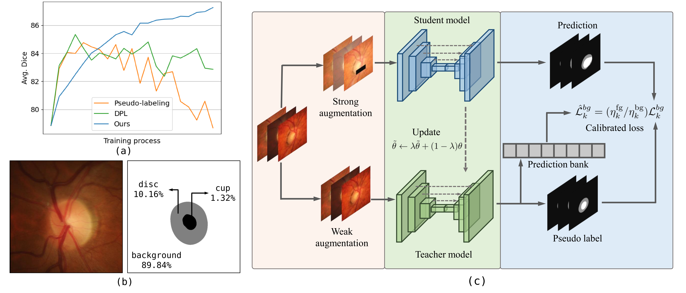

# Source-Free Domain Adaptive Fundus Image Segmentation with Class-Balanced Mean Teacher

Pytorch implementation of MICCAI'23 paper *Source-Free Domain Adaptive Fundus Image Segmentation with Class-Balanced Mean Teacher*.

<p align="center">
  
</p>

## Installation
* Install python 3.10.5, pytorch 1.12.0, CUDA 11.6 and other essential packages (Note that using other versions of packages may affect performance.)
* Clone this repo
```
git clone https://github.com/lloongx/SFDA-CBMT.git
cd SFDA-CBMT
```

## Training
* Download datasets from [here](https://drive.google.com/file/d/1B7ArHRBjt2Dx29a3A6X_lGhD0vDVr3sy/view).
* Download source domain model from [here](https://drive.google.com/drive/folders/1L23mCg8prsdu1imEQI5ouuwvVL_FSiLY) or specify the `--data-dir` in `./train_source.py` and then run it.
* Save source domain model into folder `./logs_train/`.
* Run `./train_target.py` with specified `--model-file` and `--data-dir` to start the SFDA training process.

## Acknowledgement
This repo benefits from [BEAL](https://github.com/emma-sjwang/BEAL) and [SFDA-DPL](https://github.com/cchen-cc/SFDA-DPL). Thanks for their wonderful works.
